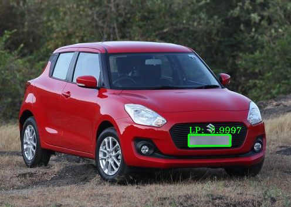

# ANPR_INDIANCARS_YOLOV3
Automatic Number Plate Recognition and Blurring for Indian Cars

 

The real-world need for License Plate detection on Indian cars has inspired this work to create the dataset of Indian cars with license plates, annotate the license plates, and train Yolov3 model on this data.  

This repository showcase how the custom dataset of Indian cars with license plates should be annotated and trained on yolov3 for the detection of license plates.

Follow ANPR_IndianCars_Yolov3.ipynb for detailed steps and test it on your own test images.

Article Link - https://medium.com/@gauravsaini.728/license-plate-detection-on-indian-cars-using-yolov3-and-blurring-of-license-plates-9f2a24d48f04
